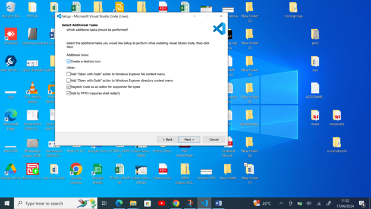

# Dev_Setup
Setup Development Environment

#Assignment: Setting Up Your Developer Environment

#Objective:
This assignment aims to familiarize you with the tools and configurations necessary to set up an efficient developer environment for software engineering projects. Completing this assignment will give you the skills required to set up a robust and productive workspace conducive to coding, debugging, version control, and collaboration.

#Tasks:
1.	Select Your Operating System (OS): Choose an operating system that best suits your preferences and project requirements. Download and Install Windows 11. https://www.microsoft.com/software-download/windows11

Answers:
STEP 1: Create Windows 11 Installation Media
I.	Download the Media Creation Tool:
a.	Go to the Windows 11 download page: https://www.microsoft.com/software-download/windows11.
b.	Under the "Create Windows 11 Installation Media" section, click "Download now".
II.	Run the Media Creation Tool:
a.	Open the downloaded Media Creation Tool executable file.
b.	Accept the license terms.
III.	Set Up the Media Creation Tool:
a.	Choose the language, edition, and architecture (64-bit) and press next.
b.	Select "USB flash drive" as the media to use. Alternatively, you can choose "ISO file" if you want to create a bootable DVD.
IV.	Create the Installation Media: 
a.	Insert a USB flash drive with at least 8 GB of storage.
b.	Select the USB drive from the list and click "Next".
c.	The tool will download Windows 11 and create the bootable USB drive.
d.	After that click finish.
STEP 2: Install Windows 11 Using the Installation Media
I.	Prepare Your PC:
a.	Back up all important data.
b.	Ensure your PC meets the Windows 11 system requirements.
II.	Boot from the USB Drive:
a.	Insert the bootable USB drive into your PC.
b.	Restart your PC and enter the BIOS/UEFI settings (commonly accessed by pressing a key like F2, F12, Delete, or Esc during startup).
c.	Change the boot order to boot from the USB drive first.
III.	Start the Installation Process:
a.	Save the changes and exit the BIOS/UEFI settings. Your PC should now boot from the USB drive.
b.	The Windows Setup screen will appear. Select your language, time, and keyboard preferences, and click "Next".
c.	Click "Install now".
IV.	Enter Product Key:
a.	When prompted, enter your Windows 11 product key. If you are upgrading from Windows 10, you may skip this step as the activation should be automatic.
V.	Select Installation Type:
a.	Choose "Custom: Install Windows only (advanced)
b.	choose windows type and click next.
VI.	Partition the Drive:
c.	Select the partition where you want to install Windows 11. You can delete existing partitions to create a new one, but this will erase all data on the selected partition.
d.	Click "Next" to start the installation.
STEP 3: Complete the Installation
I.	Follow On-Screen Instructions:
a.	Windows 11 will now be installed on your PC. The process might take some time and your PC will restart several times.
II.	Set Up Windows 11:
a.	After installation, you will be guided through the initial setup process. Configure your preferences. Sign in with your Microsoft account, and set up any additional settings.

2.	Install a Text Editor or Integrated Development Environment (IDE): Select and install a text editor or IDE suitable for your programming languages and workflow. Download and Install Visual Studio Code. https://code.visualstudio.com/Download
Anwers:
I.	Download Visual Studio: Visit https://code.visualstudio.com/sha/download?build=stable&os=win32-x64-user and click on "Download Visual Studio.

 
II.	Run the Installer: Once it is downloaded, run the installer (VSCodeUserSetup-{version}.exe)
 

III.	Accept the Agreement : Select “I accept the agreement”

IV.	Select the Destination Location Click next, default folder will be used
 

V.	Create vs code short by Click Next, by default
 

VI.	Modify Installation (Optional): If needed, you can customize the installation by clicking on the "Individual components" tab in the installer and selecting or deselecting specific components.
 

VII.	Install: Click the "Install" button to start the installation process.
 

VIII.	Launch Visual Studio: Once the installation is complete, launch Visual Studio. Sign in with your Microsoft account or create one if prompted.
 

IX.	Choose Development Environment: On the welcome screen, select your development environment. For example, you can choose "Development Settings" based on your preferred coding style.
X.	Start Coding: You're now ready to start coding! Create a new project or open an existing one to begin your development work.

3.	Set Up Version Control System: Install Git and configure it on your local machine. Create a GitHub account for hosting your repositories. Initialize a Git repository for your project and make your first commit. https://github.com
Answers:
I.	Download Git for Windows: Go to https://git-scm.com/downloads and download the latest version for your operating system.
 

II.	Run the Installer: Open the downloaded Git installer.
 

III.	Run the Git installer (Git-2.38.0-64-bit.exe). The installer wizard will appear. Accept the license agreement and click next.
 

IV.	choose the location where you want the Git installation to be kept. Accept the default location and click next.
 

V.	Follow the Installation Wizard: Choose the default options or customize the installation according to your preferences. Some key settings to note:
	Adjusting your PATH environment.
	Choosing the HTTPS transport backend.
	Configuring the line-ending conversions.
	Choosing the default Git editor.
VI.	You’ll be prompted to create a start folder. Leave it as is and click Next.

VII.	Choose a text editor to use with Git. Click on the drop-down menu to pick the text editor you like to use like Vim.
 

VIII.	Select let Git decide

IX.	Select the recommend option and click next
 

X.	Select Use bundled openSSH and click next
 

XI.	select use the openSSL library and then next
 

XII.	Select Checkout windows-style, commit unix style line endings
 

XIII.	Select use Mintty and then NEXT

 

XIV.	Select Fast forward or merge and then click next

 

XV.	Select Git Credential Manager
 

XVI.	Select Enable File system caching and then click Next.
 

XVII.	Wait while setup installs Git on your computer
 

XVIII.	Launch Git Bash and click Finish

 

XIX.	Verify the version of Git installed in Git Bash by running the command git –version then enter
 

Create a GitHub Account
	Sign up for a GitHub account at GitHub. https://github.com
	Enter your information:
	Unique username
	Email address
	Password
	Confirm password
	Create GitHub account
	Click on the link to verify your email address.
Initialize a Git repository
I.	Create a new repository on GitHub:
	Go to your GitHub profile page and click on your profile picture.
	Go to your profile.
	Click on your repositories.
	Click on “Create new repository”.
	Fill in the details:
	Repository name
	Repository description
	Select “Public”
	Select “Initialize this repository with a README”(optional)
	Add .gitignore (optional)
	Click on “Create repository”.
	Choose a license (optional)
II.	Click "Create repository"
 

Cloning Git Repository
	Copy the repository URL from the GitHub page.
	Open Git Bash or Command Prompt.
	Run git clone repository URL
	navigate to the cloned repository and run git status to check if the repository is cloned successfully.
	verify the cloning with the ls command
Commit and Push Changes
	Create a new file: 
	Add content to the file
	Save and exit the editor 

4.	Install Necessary Programming Languages and Runtimes: Instal Python from http://wwww.python.org programming language required for your project and install their respective compilers, interpreters, or runtimes. Ensure you have the necessary tools to build and execute your code. 
Answers:
I.	Visit  https://www.python.org/downloads/  download the latest release. Choose Windows installer (64-bit) and proceed to download the executable file.
 

II.	Once you have downloaded the installer, open the .exe file by double-clicking it to launch the Python installer. Choose Use admin privileges when installing and  add python.exe to PATH 
 

III.	After Clicking the Install Now Button the setup will start installing Python on your Windows system. 
 

IV.	After completing the setup. Python will be installed on your Windows system. 
 

V.	Close the window check if the installation of Python was successful by using Git Bash to run python –-version
 

5.	Install Package Managers: If applicable, install package managers like pip (Python).
Answers:
I.	Download pip: Download the get-pip.py (https://bootstrap.pypa.io/get-pip.py) file and store it in the same directory as python is installed.
II.	Change the current path of the directory in the command line to the path of the directory where the above file exists. 
III.	To install pip python3. Run the command: python get-pip.py
VI.	Wait the installation process to complete.
VII.	verify if the pip has been installed correctly by using this command pip –version in Git Bash or CMD, Install pip.
VIII.	Add pip to Environment Variables: Go to Control Panel search for Environment Variables then Double-click the PATH variable under System Variables. Then Click New, and add the directory where pip is installed.

6.	Configure a Database (MySQL): Download and install MySQL database. https://dev.mysql.com/downloads/windows/installer/5.7.html
Answers:
Visit official website: https://dev.mysql.com/downloads/windows/installer/5.7.html

 

I.	Click No thanks, just start my download
 

Run the Installer
 

II.	Wait while windows configure MYSQL Installer
 

III.	Choose Setup Type: Choose a setup type (Developer Default, Server only, etc.) and click Next.
 

IV.	Check for Requirements: The installer will check for and install the necessary dependencies.
 

V.	Installation: Click Execute to install the selected MySQL products.
 

VI.	Configuration: Next, you need to configure the MySQL server, click "Next":
 

VII.	Standalone MySQL Server: Select the "Standalone MySQL Server / Classic MySQL Replication" item and click "Next":
 

VIII.	Config Type,  parameter, select "Server Computer" select TCP/IP; Next and click "Next":
 

IX.	Password and authentication : Select use strong Password Encryption for Authentication(RECOMMENDED)" and click "Next":
 

X.	At the next step, we leave all the default settings, and click "Next":
 

XI.	MySQL server settings: Next, AND “Execute":
 

7.	Set Up Development Environments and Virtualization (Optional): Consider using virtualization tools like Docker or virtual machines to isolate project dependencies and ensure consistent environments across different machines.
Answers:
Using Virtual Machines:
 Install Virtualization Software
Using Virtual Machines
 
         Install Virtualization Software
	Download and install Virtual Machine from the Vmware workstation website.
	VMware Workstation Player: Download and install from VMware. 
Download an OS Image
	Download an ISO file of the operating system you want to use 
     Create a Virtual Machine
	Open VMware Workstation Player.
	Create a new VM:
	In VMware Workstation Player, click "New" and follow the prompts.
	Configure VM settings:
	Allocate memory (RAM) and CPU cores.
	Create a virtual hard disk.
	Install the OS:
	Start the VM and select the downloaded ISO file.
	Follow the installation instructions for the chosen operating system.
Below are all the screenshots for VMWARE installation;
 
 
 
 
 
 
 
 
 

 

 

 

 

 

 

8.	Explore Extensions and Plugins: Explore available extensions, plugins, and add-ons for your chosen text editor or IDE to enhance functionality, such as syntax highlighting, linting, code formatting, and version control integration.
Answers
Here are some essential extensions of VS Code:
I.	Code Runner: Runs code snippets or entire files directly from VS Code.
II.	Live Server: Launches a local server with live reload for static and dynamic pages.
III.	HTML Snippets: Provides quick access to common HTML code snippets.
IV.	Python: Provides IntelliSense, linting, and debugging for Python files.
V.	Prettier: Formats code automatically based on defined rules.
VI.	MYSQL Tools: Interacts with databases directly from VS Code.
VII.	CSS Peek: Navigate to CSS definitions from HTML files
VIII.	C/C++: Enhances C/C++ language support.
IX.	Stylelint: Detects and fixes style issues in CSS and SCSS files.
X.	GitLens: Visualizes and provides Git integration.
XI.	IntelliSense for CSS class names in HTML: Adds autocomplete for CSS class names.

9.	Document Your Setup: Create a comprehensive document outlining the steps you've taken to set up your developer environment. Include any configurations, customizations, or troubleshooting steps encountered during the process.
Answers:
Problems faced:
I.	Virtualization: Installing and configuring was very hard.
II.	Downloading Windows 11 Pro 64 Bit Operating system was time consuming as my internet was down.
III.	Git: Understanding Git commands and setup was hard for me.
IV.	MySQL Installation: Ensuring PATH was correctly added required careful attention.
Solutions:
I.	Virtualization: Followed detailed tutorials on VMWARE Workstation .
II.	Downloading Windows 11 Pro 64 Bit Operating system: waited for midnight to take advantage of cheap data.
III.	Git: referred to Git videos by Geeks4geeks in Youtube.
IV.	MySQL Installation: Added to the PATH environment variable.
V.	MySQL: Used MySQL official documentation and community forums for troubleshooting.

#Deliverables:
•	Document detailing the setup process with step-by-step instructions and screenshots where necessary.
•	A GitHub repository containing a sample project initialized with Git and any necessary configuration files (e.g., .gitignore).
•	A reflection on the challenges faced during setup and strategies employed to overcome them.
References: PLP videos, Documentations, Geeksforgeks.org, phoenixnap.
#Submission: Submit your document and GitHub repository link through the designated platform or email to the instructor by the specified deadline.
#Evaluation Criteria:**
•	Completeness and accuracy of setup documentation.
•	Effectiveness of version control implementation.
•	Appropriateness of tools selected for the project requirements.
•	Clarity of reflection on challenges and solutions encountered.
•	Adherence to submission guidelines and deadlines.
Note: Feel free to reach out for clarification or assistance with any aspect of the assignment.

